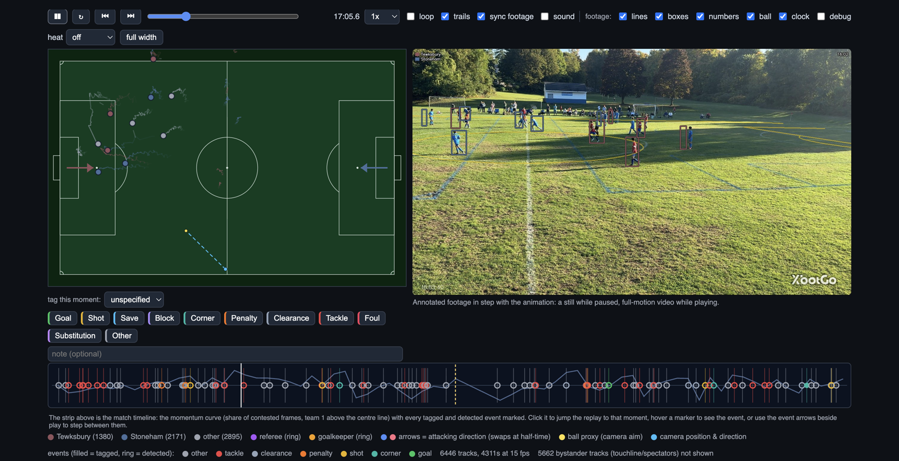
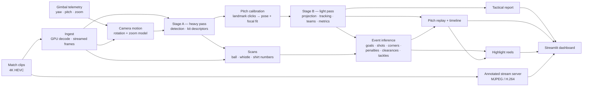
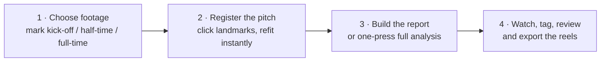

# Soccer Video Analytics

**Match analysis from a single camera that follows the ball.**

This project turns video from an ordinary sideline gimbal camera — one that pans, tilts and zooms to track play — into pitch-space analytics: player tracks, teams, distances and speeds, possession and momentum, inferred match events, a synchronized pitch replay, and highlight reels. A Streamlit dashboard drives the whole workflow: analyze, review, correct by hand, export.

The camera's motion is the central problem. A following camera has no fixed viewpoint, so the usual assumption that a pixel means the same place on the pitch from one second to the next does not hold. The pipeline therefore recovers the camera's motion first — visual estimation backed by the camera's own telemetry where a log exists — registers the pitch from a handful of landmark clicks, and performs all further analysis in pitch meters.



*The match view. The pitch replay and the annotated footage run in step, with the tag bar for manual events and the match timeline below — a track per event type along the momentum curve, each marker shaped by its kind (▲ offensive, ■ defensive, ● other).*

## Highlights

- **Pitch-space player tracking** — players projected to meters, tracked across pans, zooms and clip joins, and split into the two teams from measured kit color.
- **Tactical report** — per-player and per-team distance, speed, territory, possession and momentum, with team naming, and the referee and goalkeepers identified automatically.
- **Ball, whistle and shirt-number scans** — each independent, resumable, and started from the dashboard.
- **Event detection** — goals, shots, corners, penalties, clearances and tackles inferred conservatively from the ball scan and player tracks; every candidate is a review item with a note describing what was measured.
- **Human-in-the-loop review** — manual tags (foul, save, block, substitution, …) sit on the same timeline as inferred events, and detections can be accepted, rejected or discarded in bulk.
- **Synchronized replay** — a pitch animation and the annotated footage side by side, with trails, heat maps, attack-direction arrows and an interactive event timeline.
- **Highlight reels** — three tiers (`clip`, `goals`, `match`) cut from the tagged and detected events.
- **Annotated match stream** — MJPEG and H.264 renditions of the match with pitch markings, boxes, shirt numbers and a clock, viewable directly in a browser.
- **Self-contained archives** — everything computed for a match lives beside its footage and moves as a single folder; the original clips are read directly, so no merged video is ever written.

## How it works



### Two-stage split

The analysis is deliberately split in two, because the expensive part (everything that touches video) and the useful part (everything that can be recomputed from it) change at very different speeds.

**Stage A** is heavy, GPU-bound and run once per segment. It decodes the video, recovers camera motion frame by frame, detects players and records a compact kit-color descriptor for each detection. It writes chunk files so it can resume, and a `status.json` the dashboard polls for progress. It samples at 15 fps by default (the common 60 and 30 fps source rates both divide by it), and every frame-count window downstream is derived from seconds at the segment's own rate, so segments built at other rates keep their tuned behavior.

**Stage B** is light and re-runnable in seconds. It projects the stored detections onto the pitch using the current calibration, tracks players, assigns teams and computes the metrics — no video decoding at all. Re-clicking a landmark therefore costs seconds, not hours; pitch registration deliberately happens after Stage A.

Because the kit descriptor is a pure function of one decoded frame and one stored box, `scripts/refresh_kit_descriptors.py` can re-derive descriptors in place — minutes instead of the hours a full Stage A re-run would cost — without touching detection or camera motion.

### Camera motion recovery

Each frame-to-frame step is modeled as a rotation plus a focal-length scale, $H = K_c \, R \, K_g^{-1}$, with orientation integrated in SO(3) rather than by chaining free homographies. Free chained homographies random-walk in their perspective terms and produce a degenerate 674× zoom within about 70 seconds of real footage; the rotation model stays stable across the full measured pan range (−87° to +29°). Focal length and the zoom deadband are self-calibrated from measured step statistics rather than configured.

Where the camera writes its own telemetry, the pipeline prefers the measurement over the estimate. The gimbal log beside each clip records the yaw and pitch the camera commanded every frame, its zoom step and its ball-lock state — a hardware measurement of where the camera pointed that does not drift. Its scale is fitted against the visual chain, and a calibration records which motion source it was fitted against; the dashboard asks for a refit rather than projecting through a stale pose. On the reference match, a pose fitted on the opening minutes predicts landmark clicks 40 minutes later to a median of 16 m, against 48 m for the visual estimate alone, and re-fitting the existing clicks against log-backed motion cuts the calibration RMS from 2.55 m to 1.14 m.

The ball-lock telemetry is also used directly, with no homography at all: a sustained lock means live play and a long gap means a stoppage, and the lock's image position yields an image-space possession estimate that survives even a poor calibration.

### Pitch registration

The pitch's known geometry — standard markings for each match format — is fitted to the video against a handful of clicked landmarks: the corners, the goalposts, the penalty spots and the center-circle cardinals. Because the camera motion is already known, the fit solves only for the camera's position, its rotation and a focal-length scale.

The app is conservative about what it claims. It reports a residual per click and names the clicks that disagree with the rest, by landmark and frame; it draws the full set of pitch markings back over the frame — including landmarks that were never clicked — so a mirrored or mislabeled click is visible at a glance; and it refuses to present a fit whose solver ran a parameter to the edge of its search range. A fit that is no good can be discarded and redone from the same panel.

Practical guidance, measured against a simulated match with 4 px of click noise: four distant landmarks could be out by more than 50 m, while eight spread across the frame stayed within 2.4 m. Six is usually enough, four is the bare minimum, and spread matters more than count. When a corner is not in shot, the bases of the goalposts are dependable substitutes — the two posts of a goal are 7.32 m apart and pin that end of the pitch the way the corner flag does. Clicks made on different frames are combined, so a landmark that is out of view in one frame can be clicked in another. A wrong match format does not show up in the fit residual at all: it moves the recovered camera height (2.3 / 3.9 / 6.9 m for the same pitch described as 60% / 100% / 167% of its true size), which is what the app checks instead.

### Ball, whistle and shirt-number scans

These run on demand from the dashboard, independently of each other, and resume from checkpoints.

- **Ball scan** — re-reads the segment at full resolution with two detectors and follows the ball frame by frame, keeping true sightings, short forecasts and "out of the picture" distinct. It is the most expensive scan (about 70 minutes for a full game on the reference hardware). On the reference match it held the ball on 70% of frames — 15,071 detected, 5,380 forecast across one-frame misses, 742 out of view, 359 lost — and 61% of the frames it saw also project onto the ground; an airborne ball has no ground intersection and is left undrawn rather than guessed at.
- **Whistle scan** — a referee's whistle is a loud, sustained, tonal blast, and the detector requires all three: a narrow-band peak dominating the 2.2–4.6 kHz band, held for at least 0.2 s, and loud relative to the match's own median level in that band, so the gate does not depend on the recording level. A sideline microphone can hear a near whistle up to ~30× louder than a far-half one, so the default tuning leans slightly toward recall; every candidate records its measured level, so the loudest can be trusted first.
- **Shirt-number scan** — OCR over player-sized torso crops, with motion-blur rejection; a number is accepted only when several independent crops agree. The number is read off the footage per track; the *name* comes from the team roster the match links (jersey numbers to player names, typed once per team and reused in future matches). The OCR engine is imported lazily and its absence is reported in the scan status rather than breaking the page.

Ball positions that feed event inference are filtered before use. The projection turns a pixel of jitter into meters when the ball is far away, so positions more than 3 m off the pitch are dropped, spikes are rejected, and speed is the net displacement over a short look-back window paired with a straightness ratio — jitter is fast but not straight, a struck ball is both. That leaves the real scan's speeds physical (p50 2.4 m/s, p90 15 m/s; nothing on a soccer pitch travels faster than ~45 m/s).

### Event inference

The detectors are conservative by design — a wrong event on the timeline is worse than a missing one — and every event carries a note saying what it measured.

- **Goal** — the ball reaches a goal mouth moving in, and is reset to the center spot within a minute. The reset is what separates a goal from a shot into the side netting, and it must be a measured position: the scan can lose the ball against the net.
- **Shot** — a hard kick aimed at a goal that did not produce a reset. A save and a shot wide look the same to a ball track, so both are reported as a shot with the note saying where it was aimed; saves and blocks stay manual tags.
- **Corner** — a ball at rest near a corner flag that is then kicked (or a fresh detection entering from a corner).
- **Penalty** — a whistle, the ball still on the penalty spot, then a hard kick; without the whistle, the same geometry is left to the shot detector.
- **Clearance** — a hard, long kick away from the goal the team is defending, starting from its own defensive third.
- **Tackle** — a motion proxy: a player who was moving comes to a near stop beside the ball as the ball's own velocity changes (the note says it is a proxy, not pose).

Which end each team defends is read per half from where its players spend the half. That is what tells a clearance from a shot — the same fast kick is one or the other depending on which goal it is heading away from — and it drives the attack-direction arrows on the replay. On the reference match the detectors reported 8 events in 72 minutes: five challenges, a clearance, a goal and a shot. All land in the same review queue as the whistle candidates, with the same verdict controls.

### Report, replay and highlights

The report covers every player the camera saw: distance (summed only over the stretches where the player was actually tracked), speed (95th percentile, clipped at a plausible sprint ceiling), territory, possession and a per-minute momentum curve. Possession is attributed to the team whose player is nearest the camera's aim point — counting detections per team instead lets the referee, who follows the ball all match, decide possession (a measured 10-point swing).

Players are split into teams by measured kit color. A player's torso crop is mostly pitch, so the grass is measured per frame and masked out first, using the 2nd–98th percentile of the frame's own grass pixels (which covers 98%+ of them, against 51–94% for a fixed hue band). Only player-sized, well-evidenced tracks are allowed to vote — near-sideline bystanders, coaches and spectators are excluded — which cuts roughly 2,800 stitched tracks to about 150 voting tracks and makes the team split clean.

The replay animates the tracked players on a pitch drawn to the calibrated scale, with trails, optional heat maps, referee and goalkeeper roles, and the attack-direction arrows. Its timeline strip shows the momentum curve with a track per event type — markers shaped ▲ offensive, ■ defensive, ● other, filled for tags and hollow for detections; clicking seeks the replay, the arrows step between events, and hovering names the event. Beside the animation, the annotated footage of the exact moment stays in step — a still while paused, a live stream while playing.

Highlight reels are cut in three tiers — `clip` (15–30 s), `goals` (1–2 min) and `match` (up to 5 min) — assembled from the event timeline, where manual tags weigh more than inferred candidates. Cuts are encoded from the original clips, clip by clip, and joined by stream copy.

### No merged media

`game.json` is the recording: it lists the camera clips and their game-clock offsets, and every consumer reads through the clips. Stage A chains frames across a clip join on one analysis grid; the scans seek inside the clip that holds the second they want (the whistle scan's audio is stitched into a single wav first, so its clock matches the game's); highlight cuts and previews are encoded clip by clip and joined by stream copy; and marking the game timeline reads stills and MJPEG straight from the clips. A window that lies inside one clip is the ordinary single-file command on that clip, and archives built before the manifest existed keep working.

## The dashboard



The dashboard walks through four steps in order, and each one stores its result so nothing is ever repeated.

1. **Choose footage.** Pick a folder and video (found under `data/videos` and the `SOCCER_VIDEO_ROOTS` directories, newest first), mark kick-off, half-time and full-time on the game timeline, choose a start offset and length, and press *Run analysis*. The heavy pass runs in the background; progress, analyzed frames per second and lost frames come from the segment's `status.json`, and a re-run resumes from the last completed chunk. A video that already has an analysis opens it when it is picked.

2. **Register the pitch.** Click pitch landmarks on any frame: the four corners first, then goalposts, penalty spots and center-circle cardinals — from one frame or several, because clicks made on different frames are combined. The magnified view and the whole frame sit side by side: click the whole frame to aim the magnified view, scroll to zoom, then click a landmark and pick which one it is in the list that appears. The click is committed the moment you pick, and the calibration refits itself automatically from the clicks so far.

3. **Build the report.** Project detections, track players, split them into teams and compute the metrics — seconds, and re-runnable after re-clicking landmarks without touching the video. *Build report + run all detections* does the same and then everything else in the background: the ball scan, the whistle scan and the shirt-number scan, the event detectors over what they find, and a final rebuild. Every stage skips or resumes finished work, so a long scan can be left running.

4. **Watch, tag and cut highlights.** Tag buttons stack under the pitch animation (Goal, Shot, Save, Tackle, Foul, Corner, Penalty, Block, Clearance, Substitution, Other, with a team picker and an optional note): a press stamps the event on the playback's own second, so tagging happens while the moment is on screen. Inferred events and whistle candidates arrive in the same review queue, with verdict buttons and per-event notes. Reels are exported from the events in three tiers, and the annotated footage runs beside the animation, synced to the same second, offering to start the stream server when it is not running. **Team rosters** are edited under the playback: each team links a saved roster of shirt numbers to player names, and every track the scan gives one of those numbers is then labelled with the name — in the animation, the tables, the events and the stream. A roster stored once is picked again for the next game between the same teams.

### The annotated stream server

The footage pane is served by a small stream server of its own, which can also be opened directly:

```bash
.venv/bin/python scripts/run_match_stream.py --port 8510
```

Every stream is annotated from the archive's own data — pitch markings projected through the corrected camera chain, a box on each tracked player in their measured team color with a shirt-number chip (or `#track_id` until a number is known), the ball from the scan (drawn only where a detector actually saw it — a position the tracker merely forecast is left unmarked) and a clock/legend HUD. The stream draws what the archive already knows and invents nothing: a replay without stored boxes is refused with the command that rebuilds it, and a stale shirt-number scan is called out in the corner rather than mapping numbers onto the wrong tracks.

| Route | Description |
| --- | --- |
| `/` | index of streamable matches |
| `/play/<match_id>` | player page (embeds the stream in an ``) |
| `/stream/<match_id>.mjpg` | MJPEG stream; `start`, `rate`, `width` |
| `/frame/<match_id>.jpg` | one annotated still; `t` |
| `/live/<match_id>.mp4` | endless fragmented MP4; `fps`, `rate`, `width`, `overlays`, `audio` |
| `/video/<match_id>.mp4` | bounded, seekable, cached clip; `duration`, `codec=h264\|hevc` |
| `/game/<game_id>.mjpg` | marking stream straight from the clips; `t`, `width`, `fps`, `frames` |
| `/matches` | available matches as JSON |

Each viewer gets their own decode, so streams can start at different times and speeds; `rate` is capped by how fast the footage decodes, and when that is slower than real time the pane restarts the stream at the animation's second rather than drifting away from it (switch *sync footage* off to let it play on its own). Safari and other WebKit browsers get the MJPEG stream — Apple's media stack will not play an endless fragmented MP4 — and the pane falls back the same way in any browser whose video loads keep failing.

## Outputs

Every analysis is *self-contained*: it lives in an `analysis/` folder beside the footage it was made from, named by the recording date and the video, and holds everything computed for that match.

```
<footage root>/<date>/
    <clip>.MP4                  # original camera clips, untouched
    analysis/<match_id>/
        match.json              # footage, analyzed window, half marks, team names
        calibration.json        # landmark clicks and the fitted camera pose
        report.json             # players, teams, metrics, possession, momentum
        replay.json             # per-frame pitch positions and team assignment
        events.json             # tagged and detected events with review verdicts
        jerseys.json            # shirt-number scan: per-track suggestions (the numbers read off the footage)
        roster.json             # per-track manual corrections (team rosters live in data/rosters, shared)
        identities/             # a still of each appearance, for recognizing who a track is
        highlights/             # exported reels and their manifests
        game.json               # the clip manifest — the recording
        segments/<segment_id>/  # Stage A chunks, status.json, ball scan
```

Recorded paths are stored relative to the folder and re-resolved on load, so a match directory can be copied or moved as a unit. Footage can be organized with one directory per match, and recordings split into several clips are described by the manifest. `scripts/migrate_analysis.py` moves archives from the older repository-era roots into this shape.

## Getting started

### Requirements

- Linux, an NVIDIA GPU and `ffmpeg` built with NVDEC and NVENC. The reference machine is a Quadro P2200 (5 GB) with 12 GB of RAM and 6 cores; the pipeline decodes on the GPU and streams frames rather than buffering files, and is tuned to stay comfortable on hardware of this class.
- Python 3.12.
- Chrome, Edge or Firefox for the dashboard; Safari and other WebKit browsers are supported through the MJPEG fallback.

Stage A analyzes at 15 fps and detects at the source's native resolution by default (`--width` caps it). For a 72–80 minute 4K game, expect about 90 minutes at 1920-wide detection and a few hours at the full native resolution, which finds roughly 40 players per frame against 33 at 1920 — mostly extra far-side players. Everything re-runnable — calibration, the report, the replay, event inference, reel selection — takes seconds.

### Install

```bash
export PATH="$HOME/.local/bin:$PATH"   # uv
uv venv --python 3.12 .venv
source .venv/bin/activate
uv pip install -e ".[dev]"
```

The Quadro P2200 is sm_61, so install PyTorch from the CUDA 12.6 index:

```bash
uv pip install torch --index-url https://download.pytorch.org/whl/cu126
```

`easyocr`, the shirt-number scan's OCR, is a declared dependency and is imported lazily by that scan only. It brings its own torch/torchvision, so on a CUDA box install it after the cu126 torch above, or it will drag in the CPU wheel.

### Run the dashboard

```bash
.venv/bin/streamlit run src/soccer_analytics/dashboard/app.py --server.port 8505
```

Additional footage roots are configured with `SOCCER_VIDEO_ROOTS` (colon-separated paths, searched after the repo's own `data/videos`). Detection weights default to stock YOLO weights fetched on first use; a checkpoint dropped into `data/models/` is preferred over them, and `scripts/run_stage_a.py --weights` overrides both. The heavy pass can also be run headlessly — `scripts/run_stage_a.py` for a segment, and `scripts/rebuild_match.py` to rebuild the report and replay from stored detections.

## Repository layout

```
src/soccer_analytics/
    ingest/      # GPU-accelerated frame and audio I/O, clip-set source reader
    geometry/    # camera motion (visual and gimbal telemetry), pitch calibration
    analysis/    # Stage A/B, ball scan, kit and jersey analysis, events, highlights
    dashboard/   # Streamlit app, replay and annotation components, stream server
    tracking/    # team classification
tests/           # including a synthetic-match oracle with known ground truth
scripts/         # entry points and probes: run_stage_a.py, run_ball_scan.py,
                 # run_match_stream.py, run_build_game.py, rebuild_match.py,
                 # refresh_kit_descriptors.py, migrate_analysis.py, ...
```

## Tests

```bash
.venv/bin/python -m pytest -q
```

`tests/synthetic_match.py` is the oracle: it simulates a gimbal camera aiming at a ball, with known player trajectories, kit colors, detection noise and misses. The stage tests assert against that ground truth, including a mutation-tested resume-equivalence check for Stage A and distances measured only over *observable* stretches.

## Accuracy and limitations

The report is only useful if its numbers can be trusted, so the known limits are stated plainly:

- **The camera sees part of the pitch at a time** — it follows play — so only what is visible is measured; team shape and full-team formation are explicitly not claimed.
- **Distances are per visible run.** A player's distance is summed over the stretches where they were actually tracked, not extrapolated across gaps.
- **Far-side landmarks are uncertain.** At 40–90 m, four pixels of click noise costs 0.6–5 m of ground error in the depth direction, which is why calibration reports a residual per click and rejects outliers.
- **The ball is tracked by its own scan, not by the report.** Where no scan has run, the camera's aim point is used as a ball proxy for possession, and the report says so; events are only inferred where a scan exists. Even with a scan, an airborne ball has no ground point and is left undrawn.
- **Possession is a proximity estimate** — the nearest player to the camera's aim — intentionally, because per-team detection counts hand possession to the referee, who follows the ball all match.
- **Very fast pans are the least reliable moments.** During rapid pans the image moves fastest, detector lag grows, and short-window speeds are inflated by a small, measured, pan-locked image artifact that is not a fixable camera-pose error. The analysis flags segments with fast pans; treat their short-window speeds with caution.
- **Jersey numbers depend on OCR quality.** A number is accepted only when several independent crops agree, and a stale scan is flagged rather than silently mapping numbers onto the wrong tracks.
- **Saves and blocks are manual tags.** A ball track cannot distinguish a save from a shot wide, and the pipeline does not pretend otherwise.
